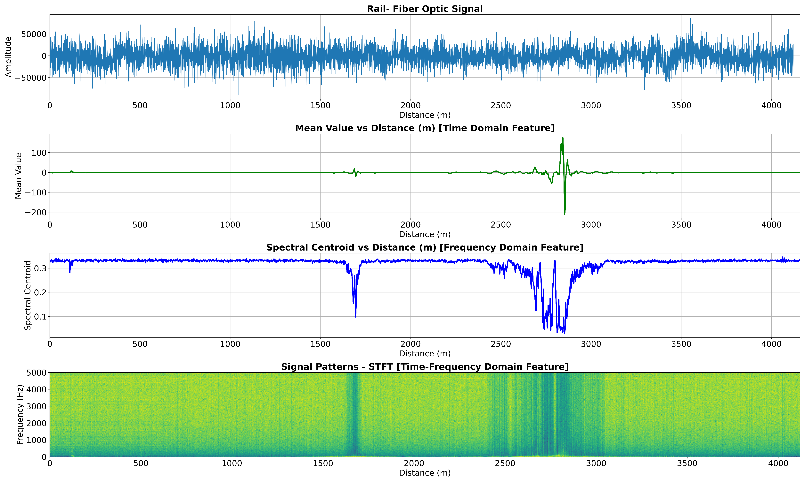
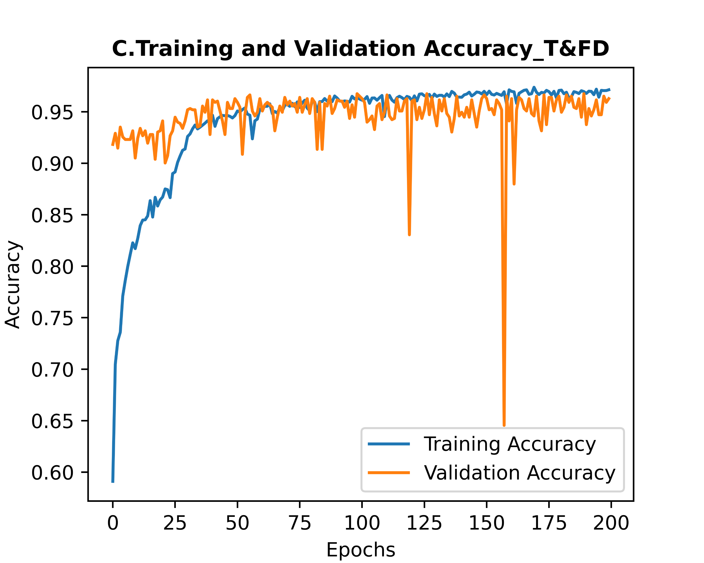
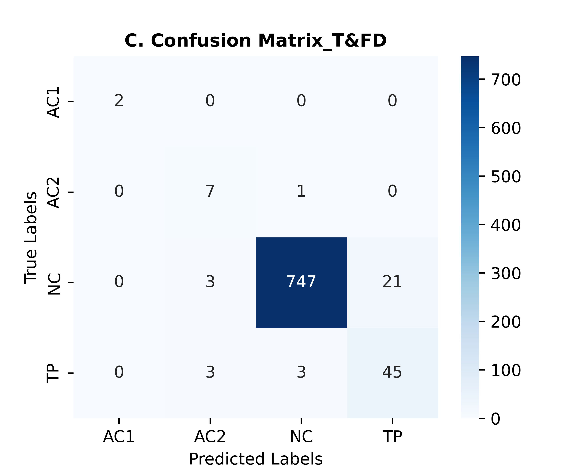
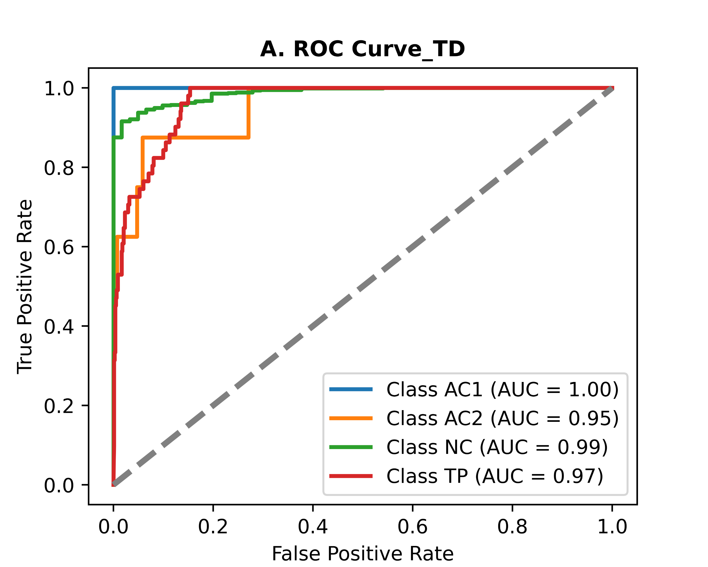

# Railroad Anomaly Detection via DAS — CNN-LSTM-SW

[](https://doi.org/10.1016/j.geits.2024.100178)
[](https://www.python.org/)
[](https://www.tensorflow.org/)
[](LICENSE)
[]()

> **Published:** *Green Energy and Intelligent Transportation*, Elsevier, 2024
> **DOI:** [10.1016/j.geits.2024.100178](https://doi.org/10.1016/j.geits.2024.100178)
> **Authors:** M.A. Rahman, S. Jamal, H. Taheri

---

## Overview

This repository contains the implementation of a hybrid **CNN-LSTM with Sliding Window (CNN-LSTM-SW)** model for real-time railroad condition monitoring and anomaly detection using **Distributed Acoustic Sensing (DAS)** fiber-optic signals.

The model was developed and validated on live High Tonnage Load (HTL) loop data from the **AAR/TTCI test facility in Pueblo, CO** — a 4.16 km DAS fiber-optic instrumented railroad track.

### Key Results

| Model | Train Position Detection | Anomaly Classification |
|---|---|---|
| CNN-LSTM | 97% | Baseline |
| **CNN-LSTM-SW (proposed)** | **97% + corrected misclassifications** | **Best overall** |
| GRU (baseline) | 94% | — |
| LSTM (baseline) | 93% | — |

---

## Problem Statement

Distributed Acoustic Sensing (DAS) generates **large, noisy, high-frequency signals** over long railroad infrastructure. Traditional signal processing methods fail due to:

- Massive dataset volume (214,524+ data points per session)
- Unstructured noise patterns from environmental interference
- Requirement for real-time, point-to-point anomaly localization

Our CNN-LSTM-SW architecture solves these challenges by combining spatial feature extraction (CNN), temporal sequence modeling (LSTM), and a post-processing sliding window to correct misclassified labels and pinpoint anomaly locations.

---

## Model Architecture

```
DAS Fiber-Optic Signal
        │
        ▼
┌─────────────────┐
│  Preprocessing  │  → Time/Frequency/Time-Frequency domain features
└────────┬────────┘
         │
         ▼
┌─────────────────┐
│      CNN        │  → Spatial feature extraction across signal channels
└────────┬────────┘
         │
         ▼
┌─────────────────┐
│      LSTM       │  → Temporal pattern learning across time steps
└────────┬────────┘
         │
         ▼
┌─────────────────┐
│  Sliding Window │  → Post-processing to correct point-to-point errors
│      (SW)       │    and localize anomalies
└────────┬────────┘
         │
         ▼
   Condition Labels:
   [NC] Normal Condition
   [TP] Train Position
   [AC1] Anomaly Class 1
   [AC2] Anomaly Class 2
```

---

## Repository Structure

```
railroad-anomaly-detection-cnn-lstm/
├── data/
│   ├── sample/                  # Sample synthetic data for demo
│   │   └── sample_das_signal.csv
│   ├── raw/                     # Raw DAS signals (not included — see Data Access)
│   └── processed/               # Preprocessed feature matrices
│
├── notebooks/
│   ├── 01_data_exploration.ipynb       # Signal visualization & EDA
│   ├── 02_feature_extraction.ipynb     # Time/freq domain feature engineering
│   ├── 03_model_training.ipynb         # CNN-LSTM-SW training pipeline
│   └── 04_results_visualization.ipynb  # Results, plots, confusion matrices
│
├── src/
│   ├── preprocessing/
│   │   ├── __init__.py
│   │   ├── signal_processor.py         # DAS signal preprocessing
│   │   └── feature_extractor.py        # Time/freq domain feature extraction
│   ├── models/
│   │   ├── __init__.py
│   │   ├── cnn_lstm.py                 # CNN-LSTM architecture
│   │   └── sliding_window.py           # SW post-processing module
│   └── utils/
│       ├── __init__.py
│       ├── metrics.py                  # Evaluation metrics
│       └── visualization.py            # Plotting utilities
│
├── results/
│   ├── figures/                        # Output plots and confusion matrices
│   └── metrics/                        # Saved evaluation results (JSON/CSV)
│
├── docs/
│   └── architecture.png                # Model architecture diagram
│
├── requirements.txt
├── environment.yml
├── config.py                           # Hyperparameters & config
├── train.py                            # Main training script
├── predict.py                          # Inference script
├── LICENSE
└── README.md
```

---

## Results

### DAS Signal & Feature Extraction
*Raw fiber-optic signal across 4.16 km of railroad — time domain, frequency domain, and STFT features used as CNN-LSTM inputs*



### Training Performance (Time + Frequency Domain Features — Best Model)
*CNN-LSTM converges to ~97% accuracy on combined T&FD features*



### Confusion Matrix (T&FD — Best Configuration)
*Near-perfect classification across NC, TP, AC1, AC2 conditions on live HTL data*



### ROC Curves — All Condition Classes
*AC1: AUC=1.00 · AC2: AUC=0.95 · NC: AUC=0.99 · TP: AUC=0.97*



---

## Quickstart

### 1. Clone & install

```bash
git clone https://github.com/arifme071/railroad-anomaly-detection-cnn-lstm.git
cd railroad-anomaly-detection-cnn-lstm
pip install -r requirements.txt
```

### 2. Run on sample data

```bash
python predict.py --data data/sample/sample_das_signal.csv --model pretrained
```

### 3. Train from scratch

```bash
python train.py --config config.py --epochs 50 --batch_size 32
```

### 4. Explore notebooks

```bash
jupyter notebook notebooks/01_data_exploration.ipynb
```

---

## Data

The original HTL loop DAS dataset was collected at the **AAR/TTCI test facility, Pueblo, CO** under a research collaboration with **Georgia Southern University**. Due to data sharing agreements, the raw industrial dataset cannot be publicly released.

**What is included:**
- `data/sample/` — Synthetic sample data generated to match the statistical properties of the original signals, for demonstration purposes
- Full feature extraction and preprocessing pipeline that works on any DAS CSV-format input

**To use your own DAS data:**  
Format your signal as a CSV with columns `[timestamp, channel_1, channel_2, ..., channel_N]` and run the preprocessing pipeline in `notebooks/02_feature_extraction.ipynb`.

---

## Citation

If you use this code, please cite the original paper:

```bibtex
@article{rahman2024railroad,
  title={Remote condition monitoring of rail tracks using distributed acoustic sensing (DAS): A deep CNN-LSTM-SW based model},
  author={Rahman, Md Arifur and Jamal, S and Taheri, Hossein},
  journal={Green Energy and Intelligent Transportation},
  volume={3},
  number={5},
  pages={100178},
  year={2024},
  publisher={Elsevier},
  doi={10.1016/j.geits.2024.100178}
}
```

---

## Related Work

- [DAS-based Railroad CM with GRU/LSTM](https://doi.org/10.1117/1.JRS.18.016512) — *SPIE Journal of Applied Remote Sensing*, 2024
- [Review of DAS Applications for Railroad CM](https://www.sciencedirect.com/science/article/abs/pii/S0888327023008919) — *Mechanical Systems and Signal Processing*, Elsevier

---

## Author

**Md Arifur Rahman**
PIN Fellow (AI in Manufacturing) · Georgia Tech | MSc Applied Engineering · Georgia Southern University

[](https://scholar.google.com/citations?user=iafas1MAAAAJ&hl=en)
[](https://www.linkedin.com/in/marahman-gsu/)
[](https://github.com/arifme071)

---

## License

MIT License — see [LICENSE](LICENSE) for details.
